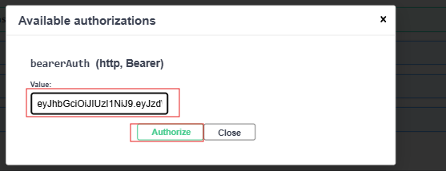

# Project Management Tool (PMT)

PMT est une plateforme de gestion de projet collaborative destinée aux équipes de développement logiciel. Cette application permet aux équipes de planifier, suivre et collaborer sur des projets de manière efficace.

## 📋 Table des matières
- [Architecture](#architecture)
- [Prérequis](#prérequis)
- [Configuration de l'environnement](#configuration-de-lenvironnement)
- [Installation](#installation)
- [Lancement du projet](#lancement-du-projet)
  - [Configuration de la base de données](#configuration-de-la-base-de-données)
  - [Lancement du Backend](#lancement-du-backend) 
  - [Documentation API](#documentation-api)
  - [Tests Backend](#tests-backend)
  - [Lancement du Frontend](#lancement-du-frontend)
  - [Tests Frontend](#tests-frontend)
- [Déploiement avec Docker](#déploiement-avec-docker)

## 🏗️ Architecture

### Diagramme de la base de données


## 📋 Prérequis

- Java 17.0.12 ou supérieur
- Maven 3.9.9 ou supérieur
- Node.js 22.12.0 ou supérieur
- Angular CLI 19.2.0 ou supérieur
- MySQL 8.0.21 ou supérieur
- Docker 28.1.1 ou supérieur
- Docker Compose 2.35.1 ou supérieur

## ⚙️ Configuration de l'environnement

### Éditeur de code
- VS Code est recommandé pour ce projet
- Le projet utilise Spring Boot (Maven) pour le backend
- Angular pour le frontend

## 🚀 Installation

### 1. Installation de Java
1. Téléchargez le [JDK 17](https://www.oracle.com/java/technologies/downloads/)
2. Vérifiez l'installation :
```bash
java -version
```

### 2. Installation de Maven
1. Téléchargez [Maven](https://maven.apache.org/install.html)
2. Vérifiez l'installation :
```bash
mvn --version
```

### 3. Installation de Node.js et Angular
1. Téléchargez [Node.js](https://nodejs.org/)
2. Vérifiez l'installation :
```bash
node -v
```
3. Installez Angular CLI :
```bash
npm install -g @angular/cli@19.2.0
ng --version
```

### 4. Installation de MySQL
1. Téléchargez et installez [MySQL Workbench](https://dev.mysql.com/downloads/workbench/)
2. Pendant l'installation, assurez-vous d'installer également le serveur MySQL

### 5. Installation de Docker
1. Installez WSL :
```bash
wsl --install
```
2. Téléchargez et installez [Docker Desktop](https://www.docker.com/products/docker-desktop/)

## 🚀 Lancement du projet

### Configuration de la base de données
1. Ouvrez MySQL Workbench et créez une nouvelle connexion :
   - Hostname : localhost
   - Port : 3306
   - Username : root
   - Password : root

2. Connectez-vous à votre serveur MySQL

3. Créez la base de données en exécutant :
```sql
CREATE DATABASE pmt;
```

4. Sélectionnez la base de données :
```sql
USE pmt;
```

5. Exécutez le script SQL initial dans MySQL :


### Lancement du Backend
1. Naviguez vers le dossier Backend
2. Lancez le serveur :
```bash
mvn spring-boot:run
```
Le backend sera accessible sur http://localhost:8080


## 📚 Documentation API

L'API est documentée avec Swagger UI. Accédez à la documentation sur :
[Swagger UI](http://localhost:8080/swagger-ui.html)

### Authentification:

Effectuez d'abord une requête de login (POST /pmt/users/login) pour obtenir votre token JWT


### Utilisation des tokens
<table>
  <tr>
    <td></td>
    <td></td>
  </tr>
</table>

Résultat d'une URL sécurisée


## 🧪 Tests

### Tests Backend
```bash
mvn clean verify
```
Pour voir le résultat, naviguez vers target/site/jacoco/index.html comme indiqué sur l'image.


### Lancement du Frontend
1. Naviguez vers le dossier Frontend
2. Installez les dépendances :
```bash
npm install
```
3. Lancez le serveur :
```bash
ng serve
```
L'application sera accessible sur http://localhost:4200

### Tests Frontend
```bash
ng test --code-coverage
```
Naviguez vers le dossier couvergae/src/index.html pour voir le résultat:


## 🐳 Déploiement avec Docker

1. Assurez-vous que Docker Desktop est en cours d'exécution
2. À la racine du projet, exécutez :
```bash
docker-compose up --build
```


